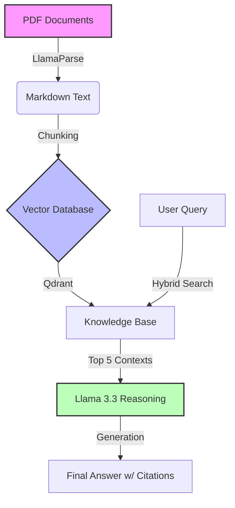

# 📊 Financial RAG Analyst: Enterprise-Grade Document Intelligence

An end-to-end Retrieval Augmented Generation (RAG) system capable of ingesting complex financial PDF documents (SEC 10-K Filings), understanding table structures, and providing precise, cited answers.



## 🚀 Key Differentiators
Unlike basic "Chat with PDF" tutorials, this project implements **Engineering Rigor**:
* **Structured Ingestion:** Uses **LlamaParse** to convert PDF tables into Markdown, ensuring high-fidelity data extraction that preserves row/column relationships.
* **Vector Database:** Implements **Qdrant** (local instance) for scalable, production-ready vector storage.
* **Reasoning Engine:** Powered by **Llama 3.3 (70B)** via Groq, allowing for complex comparative analysis (e.g., "Compare 2022 vs 2021 margins").
* **Citation Engine:** The retrieval pipeline strictly cites page numbers to prevent hallucinations (Grounding), a critical requirement for financial applications.

## 🛠️ Tech Stack
| Component | Technology | Reasoning |
| :--- | :--- | :--- |
| **Orchestration** | LlamaIndex | Best-in-class data connectors and node parsing strategies. |
| **Database** | Qdrant | Supports high-performance vector search and metadata filtering. |
| **LLM** | Llama 3.3 (Groq) | Open-source state-of-the-art model with sub-second latency for real-time chat. |
| **Embedding** | FastEmbed (BGE-Small) | Efficient, local embedding model to reduce latency and API costs. |
| **Frontend** | Chainlit | Production-grade chat interface with built-in streaming and source rendering. |

## 💻 How to Run Locally

### 1. Clone & Install
```bash
git clone [https://github.com/mickeyob/financial-rag.git](https://github.com/mickeyob/financial-rag.git)
cd financial-rag

pip install -r requirements.txt
